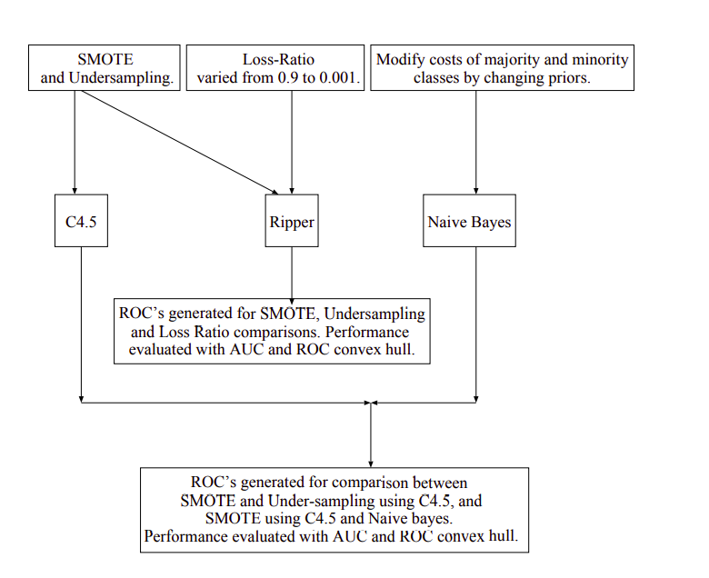

# Classification with class imbalance problem: A review

## Team Details 

Course : [CS7.403] Statistical Methods in AI        
Instructor : Dr. Anoop Namboodiri      
Team Name : Skynet      
Participants : 
- Megha Bose    
- Samyak Jain       
- Nirmal Manoj      
- Varul Srivastava

## Problem Statement

## Goals and Approach     

### Data-Driven Approach

#### SMOTE : Synthetic Minority Over-sampling TEchnique

This paper shows that a combination of our method of **over-sampling the minority (abnormal) class and under-sampling the majority (normal) class** can achieve better classifier performance (in ROC space) than only under-sampling the majority class.       

This paper also shows that a combination of our method of over-sampling the minority class and under-sampling the majority class can achieve better classifier performance (in ROC space) than varying the loss ratios in Ripper or class priors in Naive Bayes.            

<figure style="text-align:center">
  
  <figcaption>Fig.1 SMOTE Approach</figcaption>
</figure>

**`DATABASE :`** We plan to use the Pima Indians Diabetes Database, which contains 2 classes and 768 samples. The reason for choosing this was, that it's a medical database and thus, is a realistic scenario where such class imbalances occour. Number of positive class samples is only 268.    

### Algorithm Driven Approach       

## Expected Deliverables    

## Milestones and Timeline  

| Timeline | Milestone |        
|-|-|
|November 2| Project Allocation| 
|November 7| Project Proposal Finalized|
|November 14| Implementation of 4 of 8 Approaches| 
|November 21| Implementation complete|
|November 22| Project report complete|
|November 24| Project Completion|

## References

